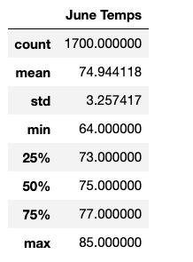

# Overview of the analysis

The main purpose of the analysis is to provide weather statistics for the months of June and December in order to determine whether the surf and ice cream shop busisness is sustainable throughout the year.

# Results

As you can see the temperature trends for the month of June,

* Average temperature for the month of June is 74°F 
* Minimum temperature that hits during the month of June is 64°F  and Maximum temperature is 85°F 

And for the month of December, 

* Average temperature is 71°F 
* Minimum temperature that hits during the month of December is 56°F  and Maximum temperature is 83°F 

# Summary

Average temperature for the month of June is only 3°F higher than that of December. Maximum temperature for the months of June and December are also not much off, only 2°F higher in June. But there is a quite a bit of difference of 10°F when we compare the lowest temperatures between those two months. December month can get much colder compared to June.

## Two additional queries that can be performed

* We can query the Measurement table to retrieve the temperatures for each of the stations for the months of June and December which gives us more information on which location is best for setting up surf and ice cream shop.

* We can also perform a query to get precipation data for the months of June & December to understand the chances of rain during those months
